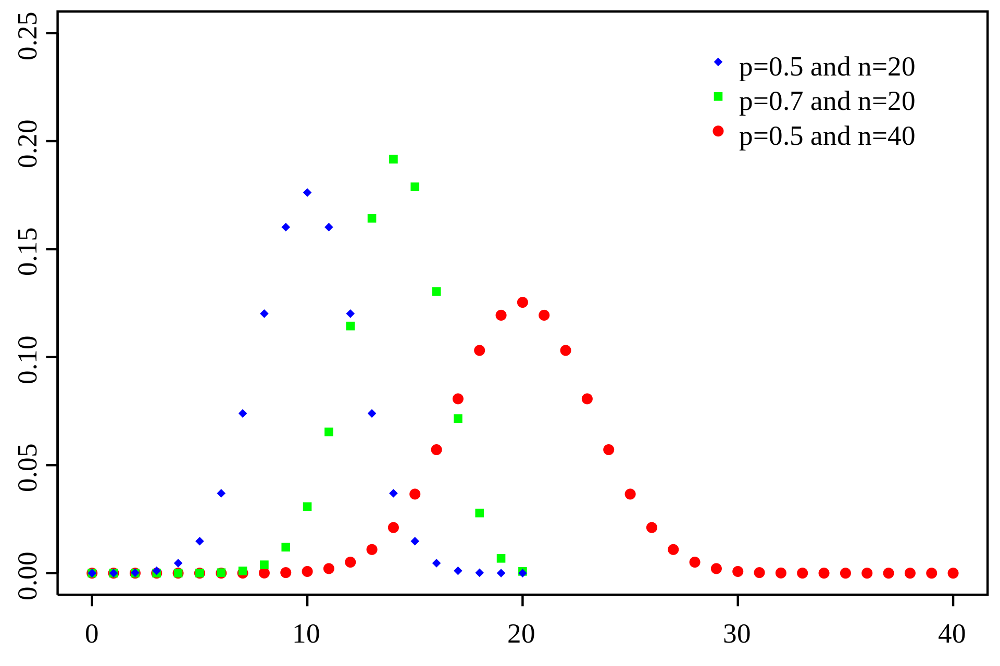

```{r constants, echo=FALSE}
library(pacman)
p_load(tidyverse, ggplot2)
```


## A great and terrible bestiary

\begin{center}

\end{center}


## Uniform distribution

Can be either discrete or continuous.

## Uniform distribution discrete

{ height=80% }


## Uniform distribution continuous

{ height=80% }


# Discrete probability distributions

## Bernoulli distribution

**probability of "success" from single trial**

Suppose we toss a coin only once. Let probability of "success" or heads be \(\theta\). We say that \(y\) has a **Bernoulli** distribution, written \(y \sim \text{Bern}(\theta)\).

\[
\text{Bern}(y | \theta) = 
\begin{cases}
\theta & \text{if } y = 1 \\
1 - \theta & \text{if } y = 0
\end{cases}
\]

Used in logistic regression, where probability modeled as a regression \[y \sim \text{Bern}(\theta = \text{logit}^{-1}(\alpha + \beta x))\].


## Binomial distribution part 1

**probability of \(y\) "successes" in \(n\) trials**

Suppose we toss a coin \(n\) times. Let \(y \in {0, \dots, n}\) be the number of heads, with the probability of heads being \(\theta\).

We say \(y\) has a **binomial** distribution, written \(y \sim \text{Bin}(n, \theta)\). The pmf is defined:
\[
\text{Bin}(y | n, \theta) = \binom{n}{y} \theta^{y} (1 - \theta)^{n - y}
\]

**Note:** Bernoulli distribution is special case of Binomial where \(n = 1\)

Used in Binomial regression, where probability modeled. Similar form to logistic regression.


## Binomial distribution part 2




## Geometric distribution part 1

**number of failures before a success:** If each pokeball we throw has probability \(1 / 10\) to catch Mew, the number of failed pokeballs will be distributed \(\text{Geom}(1 / 10)\).

Two definitions:

- The probability distribution of the number \(y\) of Bernoulli trials needed to get one success
\[
\text{Pr}(y = k) = (1 - \theta)^{k - 1} p
\]

- The probability distribution of the number \(Y = y - 1\) of failures before the first success
\[
\text{Pr}(Y = k) = (1 - \theta)^{k} p
\]


## Geometric distribution part 2


## Negative Binomial distribution part 1

**number of draws until \(n\) successes** 

Thundershock has 60% accuracy and can faint a wild Raticate in 3 hits. The number of misses before Pikachu faints Raticate with Thundershock is distributed \(y \sim \text{NBin}(r = 3, p = 0.6)\).


If \(r \in \mathbb{R}^{+}\), and \(p \in (0, 1)\), then for \(n \in \mathbb{N}\),
\[
\text{NegBinomial}(y | r, p) = \binom{y + r - 1}{y} (p - 1)^{r} (p)^{y}
\]

**WARNING:** Many alternative parameterizations! E.g. mean/dispersion parameterization used to model for overdispersed counts (see Poisson).


## Negative Binomial distribution part 2

Assuming \(p = 0.5\)...

{ height=80% }


## Hypergeometric distribution part 1

**number of "successes" in a fixed number of trails without replacement** 

There are only \(b\) Weedles (failure) and \(w\) Pikachus (success) in Viridian Forest. We encounter \(n\) Pokemone in the forest, and \(y\) is the number of Pikachus in our encounter. Population size is \(N = b + w\).

If \(w \in \mathbb{N}\), \(b \in \mathbb{N}\), and \(N \in {0, ..., a + b}\), then for \(n \in {\text{max}(0, N - b), ..., min(w, N)}\),
\[
\text{Hypergeometric}(y | N, w, n) = \frac{\binom{w}{y} \binom{N - w}{n - y}}{\binom{N}{n}}
\]


## Hypergeometric distribution part 2

{ height=70% }

\(K = w\)


## Poisson distribution part 1

**counts of rare events**

\(\lambda\) is the average number of events per unit space or time. The number of events that occur in that unit space or time is \(y\).

A certain busy intersection has an average of 2 accidents per month. Since an accident is a low probability event that can happen many different ways, it is reasonable to model the number of accidents in a month at that intersection as Pois(2).

If \(\lambda \in \mathbb{R}^{+}\), then for \(y \in \mathbb{N}\), 

\[
\text{Poisson}(y | \lambda) = \frac{1}{y!} \lambda^{y} \exp(-\lambda)
\]


## Poisson distribution part 2

- Poisson regression models \(\lambda\) as a regression \[y \sim \text{Pois}(\lambda = \exp(\alpha + \beta x))\].
  - can often poor model of our data because of overdispersion (Poisson dist assumes mean = variance)
  - Negative Binomial can be used as alternative (mean, dispersion parameterization)
- If observations not on same unit of space or time, *exposure*/*offset* help control for this.


## Poisson distribution part 3

{ height=80% }


# Continuous probability distributions

## Normal distribution part 1

If \(\mu \in \mathbb{R}\), and \(\sigma \in \mathbb{R}^{+}\), then \(y \in \mathbb{R}\), 
\[
\mathcal{N}(y | \mu, \sigma) = \frac{1}{\sqrt{2 \pi} \sigma} \exp\left(- \frac{1}{2} \left(\frac{y - \mu}{\sigma}\right)^{2}\right)
\]


## Normal distribution part 2

Alternative parameterizations

- standard deviation \(\sigma\)
- variance \(\sigma^{2}\)
- precision \(\tau = 1 / \sigma^{2}\)

Ubiquitous -- linear regression: \(y \sim \mathcal{N}(\mu = \alpha + \beta x, \sigma)\).


## Normal distribution part 3

{ height=80% }


## Student \(t\) distribution part 1

More robust than Normal distribution to outliers.

If \(\nu \in \mathbb{R}^{+}\), \(\mu \in \mathbb{R}\), and \(\sigma \in \mathbb{R}^{+}\), then \(y \in \mathbb{R}\), 
\[
\text{StudentT}(y | \nu, \mu, \sigma) = \frac{\Gamma ((\nu + 1) / 2)}{\Gamma (\nu / 2)} \frac{1}{\sqrt{\nu \pi} \sigma} \left(1 + \frac{1}{\nu} \left(\frac{y - \mu}{\sigma}\right)^{2}\right)^{-(\nu + 1) / 2}
\]

\(\mu\), \(\sigma\) like for the Normal distribution, \(\nu\) is the *degrees of freedom*. 

- Mean = mode = \(\mu\), Variance = \(\frac{\nu \sigma^{2}}{(\nu - 2)}\).
- As \(\nu\) increases, approaches Normal distribution.
- Mean defined when \(\nu > 1\), variance when \(\nu > 2\).
- When \(\nu = 1\), Cauchy (or Lorentz) distribution.


## Student \(t\) distribution part 2

{ height=80% }


## Exponential distribution part 1

**time between events (memoryless)**

Story time...

You’re sitting on an open meadow right before the break of dawn, because you could really use a wish right now. You know that shooting stars come on average every 15 minutes, but a shooting star is not “due” to come just because you’ve waited. The wait time is memoryless; the time until the next shooting star does not depend on how long you’ve waited already.

The waiting time until the next shooting star is distributed Expo(4) hours. Here \(\lambda = 4\) is the *rate parameter*, since shooting stars arrive at a rate of 1 per 1/4 hour on average. The expected time until the next shooting star is \(1 / \lambda = 1 / 4\) hour.


## Exponential distribution part 2

If \(\lambda \in \mathbb{R}^{+}\), then \(y \in \mathbb{R}^{+}\),
\[
\text{Exponential}(y | \lambda) = \lambda \exp(- \lambda y)
\]

Special case of many other probability distributions: Gamma, Weibull, Erlang, etc. Continuous analogue to Geometric distribution.

Seen in survival, or time-to-event, analysis where "age" doesn't affect survival (i.e. memoryless); canonical example is time between calls in a call center. 

Simple parametric survival model is a regression: \(y \sim \text{Expo}(\lambda = \exp(\alpha + \beta x))\)


## Exponential distribution part 3

{ height=80% }


## Gamma distribution part 1

Story time...

- You sit waiting for shooting stars, where the waiting time for a star is distributed Expo(\(\lambda\)). You want to see n shooting stars before you go home. The total waiting time for the nth shooting star is Gamma(\(n, \lambda\)).

- You are at a bank, and there are 3 people ahead of you. The serving time for each person is Exponential with mean 2 minutes. Only one person at a time can be served. The distribution of your waiting time until it’s your turn to be served is Gamma(3, 1/2).


## Gamma distribution part 2

If \(\alpha \in \mathbb{R}^{+}\) and \(\beta \in \mathbb{R}^{+}\), then for \(y \in \mathbb{R}^{+}\),
\[
\text{Gamma}(y | \alpha, \beta) = \frac{\beta^{\alpha}}{\Gamma (\alpha)} y^{\alpha - 1} \exp(- \beta y)
\]

Used in survival/time-to-event analysis.

Many distributions special case of Gamma: Exponential, Erlang, Chi-squared, etc.

Appears in Bayesian models as prior.

**WARNING:** Many alternative parameterizations!


## Gamma distribution part 2


{ height=70% }

\(\alpha = k\) and \(\beta = 1 / \theta\).
