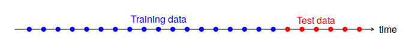
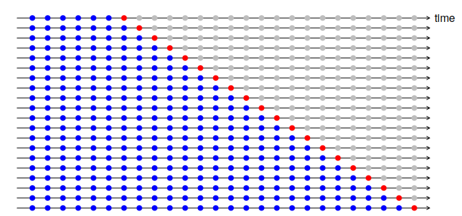
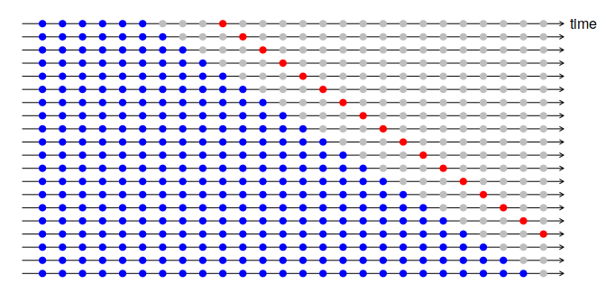

## How predictable are some events?

1. how well we understand the factors that contribute to it
2. how much data is available
3. whether the forecasts can affect the thing we are trying to forecast

## Key details

Forecasters need to be aware of their own limitations, and not claim more than is possible.

Knowing when something can be forecast accurately, and when forecasts will be no better than tossing a coin.

Good forecasts capture the genuine patterns and relationships which exist in the historical data, but do not replicate past events that will not occur again.

## Variety of forecasts

- simple models (e.g. naive method)
- complex models  (e.g. neural networks)
- no data (e.g. judgemental forecasts)

## Business forecasting

- **forecasting**
  - predicting the future as accurately as possible, given as much information as possible (data, domain, etc)
- **goals**
  - what you would like to have happen
  - should be linked to forecasts and plans
  - too often set without plan to achieve them or forecast of if they are realistic
- **planning**
  - response to forecasts and goals
  - determining the appropriate actions to make forecasts match goals

## Forecast scale

- **short-term forecasts**
  - scheduling personnel, production, transportation
  - demand
- **medium-term forecasts**
  - resource requirements
  - raw material , personnel, machinery/equipment
- **long-term forecasts**
  - strategic planning
  - market opportunities, environmental factors, internal resources

## Basic setps of forecasting

1. Problem definition
2. Gathering information
  - statistical data
  - expert knowledge
3. Exploratory analysis
  - always start by graphing
  - trends, seasons, cycles
4. Choosing and fitting models
5. Using and evaluating a forecasting model

## Staistical forecasting

[https://otexts.com/fpp3/perspective.html](https://otexts.com/fpp3/perspective.html)

## Time series patterns

- **trend**
  - long term increase or decrease in the data
  - does not have to be linear
  - can change direction (increase followed by decrease e.g. drug sales)
- **seasonal**
  - time of year/week
  - fixed and known period
- **cyclic**
  - rises and falls that are not of a fixed frequency
  - frequently related to economic conditions e.g. business cycle

[click for examples](https://otexts.com/fpp3/tspatterns.html)

## Temporal autocorrelation

- measure of the linear relationship between lagged values of a time series
- e.g. $r_{1}$ measures relationship between any value $y_{t}$ and and its preceeding value $y_{t - 1}$

$$
r_{k} = \frac{\sum_{t = k + 1}^{T} (y_{t} - \bar{y})(y_{t- k} - \bar{y})}{\sum_{t = 1}^{T} (y_{t} - \bar{y})^{2}}
$$

- a time series with no autocorrelation is **white noise**

[click for example plots](https://otexts.com/fpp3/autocorrelation.html)

## Simple forecasting tools

- average method
- naive method
  - seasonal naive method
- drift method

[click for illustrations](https://otexts.com/fpp3/simple-methods.html)

## Adjustments + transformations

- adjustments
  - calendar e.g. differing days per month
  - population
  - inflation

- transformations
  - for when variation changes with the level of the series
  - helpful to have uniform variance over time
  - e.g. logarithms, power transforms, square root

## Box-Cos transform

- combines log and power transforms

$$
w_{t} = 
  \begin{cases}
  log(y_{t}) & \text{if } \lambda = 0 \\
  (y_{t}^{\lambda} - 1) / \lambda & \text{otherwise.}
  \end{cases}
$$

- if $\lambda = 0$, natural log is used
- if $\lambda \neq 0$, a power transform is used
- if $\lambda = 1$, no change to shape of series

- good value makes size of seasonal variation about the same across series
- lots of small details about backtransforms/effect on prediction

[illustration](https://otexts.com/fpp3/transformations.html)

## Evaluating accuracy: residuals

1. *important* uncorrelated -- correlation means unmodeled variance
   - tests of autocorrelation exist (e.g. Box-Piece, Ljung-Box)
2. *important* mean 0 -- if not 0, forecast is biased
3. *nice* constant variance
4. *nice* normally distributed

[illustrations](https://otexts.com/fpp3/diagnostics.html)

## Evaluating accuracy: train + test

- forecast errors are difference between observed and forecasted
  - $e_{T + h} = y_{T + h} - \hat{y}_{T + h | T}$
- scale-dependent errors (same scale as data)
  - Mean absolute error $= \text{mean}(| e_{t} |)$
  - Root mean squared errors $= \sqrt{\text{mean}(e_{t}^{2})}$
- percentage errors (value between 0 and 1)
  - $p_{t} = 100 e_{t} / y_{t}$
  - lots of problems when $y_{t} = 0$ or is near 0
- scaled errors
  - scale errors based on training MAE from simple forecast (e.g. naive)

[illustrations](https://otexts.com/fpp3/accuracy.html)

## Time series cross-validation

one-step ahead

## Time series cross-validation

multi-step ahead

## Time series regression models

[click to check this section out](https://otexts.com/fpp3/regression.html)

